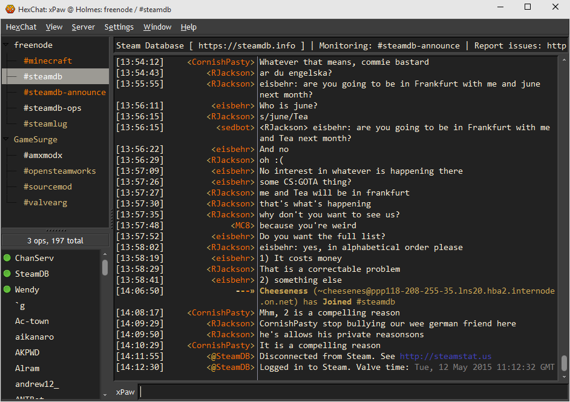

## Re Crono for HexChat

This is [Re Crono](http://lassekongo83.deviantart.com/art/Re-Crono-169044394) theme by [lassekongo83](http://lassekongo83.deviantart.com/).
There's minor tweaks to suit HexChat better, and removes all the unused files for simplicity.

How to install:

* Download [archive](https://github.com/xPaw/Re-Crono-HexChat/archive/master.zip)
* Extract to your HexChat install directory *(in Program Files folder on Windows)*
* Restart HexChat

This theme goes well with [Ubuntu Dark](https://hexchat.github.io/themes.html) color scheme.
However change background color in preferences to something like `#222222` for it to look nicer.

